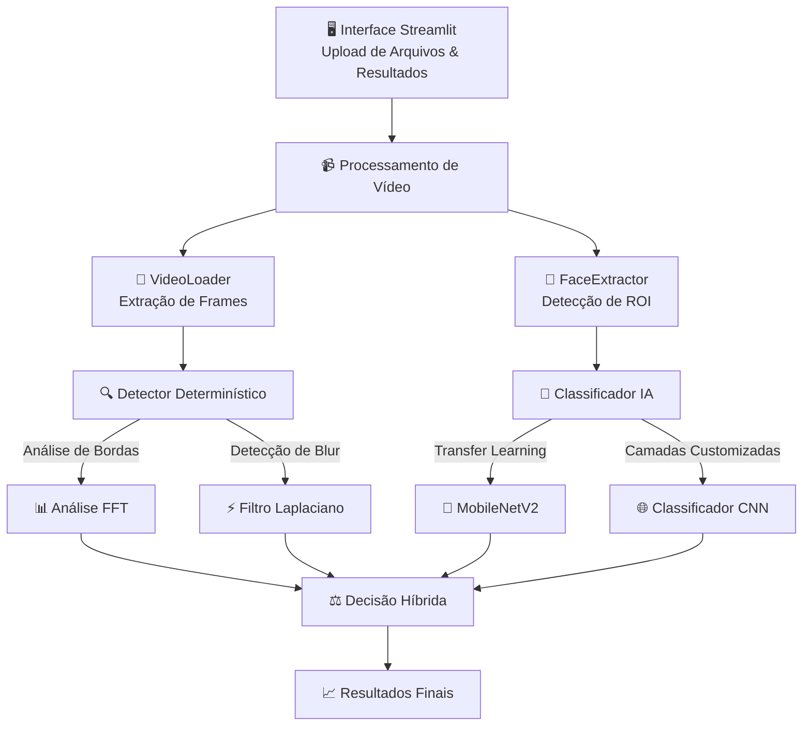

# 🕵️‍♂️ Sistema Híbrido de Detecção de Deepfakes
### *UNDB 4.0 - Projeto de Visão Computacional*

**🚀 Detecção de deepfakes de nova geração combinando análise determinística e inteligência artificial**

[](https://www.python.org/downloads/)
[](https://tensorflow.org/)
[](https://opencv.org/)
[](https://streamlit.io/)

---

### ⚡ **Início Rápido**

```bash
# Instalar dependências
pip install -r requirements.txt

# Executar interface web
streamlit run app.py
```

### 🎯 **O que Este Sistema Faz**

Este projeto implementa um **sistema de detecção de deepfakes com dupla abordagem** que combina:
- 🔍 **Análise Determinística**: Detecção baseada em regras de artefatos visuais
- 🧠 **Classificação por IA**: Rede Neural Convolucional treinada para reconhecimento de padrões

Construído com princípios de **Clean Code** e **SOLID** para arquitetura mantível e escalável.

</div>

---

## 🔬 **Tecnologias Principais**

<table>
<tr>
<td width="33%">

### 🐍 **Ecossistema Python**
- **Python 3.8+** - Linguagem principal
- **Streamlit** - Interface web interativa
- **NumPy** - Operações matemáticas
- **Pandas** - Manipulação de dados

</td>
<td width="33%">

### 👁️ **Visão Computacional**
- **OpenCV** - Processamento de vídeo e detecção facial
- **Haar Cascade** - Detecção de objetos em tempo real
- **Filtro Laplaciano** - Detecção de bordas
- **FFT** - Análise espectral

</td>
<td width="33%">

### 🤖 **Machine Learning**
- **TensorFlow/Keras** - Framework de deep learning
- **MobileNetV2** - Base para transfer learning
- **Scikit-learn** - Utilitários de ML
- **Matplotlib** - Visualização de dados

</td>
</tr>
</table>

---

## 🏛️ **Arquitetura do Sistema**



---

## 🧠 **Como Funciona**

### 1️⃣ **Processamento da Entrada de Vídeo**
| Etapa | Processo | Tecnologia |
|-------|----------|------------|
| 📤 | Upload de vídeo via interface Streamlit | `streamlit.file_uploader` |
| 🎞️ | Extração de metadados (FPS, resolução, duração) | `cv2.VideoCapture` |
| 📊 | Armazenamento temporário e validação | Manipulação de arquivos Python |

### 2️⃣ **Pipeline de Detecção Facial**

<details>
<summary><b>🔍 Componente VideoLoader</b></summary>

```python
# Processamento frame por frame com padrão generator
def load_video(video_path, frame_skip=1):
    cap = cv2.VideoCapture(video_path)
    frame_number = 0
    
    while True:
        ret, frame = cap.read()
        if not ret: break
        
        if frame_number % frame_skip == 0:
            yield frame, frame_number
        frame_number += 1
```

**Características:**
- Processamento de frames com eficiência de memória
- Pulo de frames configurável
- Métodos estáticos (princípio Clean Code)

</details>

<details>
<summary><b>👤 Componente FaceExtractor</b></summary>

```python
# Detecção facial com Haar Cascade com validação de qualidade
faces = face_cascade.detectMultiScale(
    gray_frame,
    scaleFactor=1.15,
    minNeighbors=4,
    minSize=(50, 50)
)

# Validação de qualidade e extração de ROI
for (x, y, w, h) in faces:
    if w >= 50 and h >= 50 and 0.8 <= w/h <= 1.2:
        face_roi = frame[y:y+h, x:x+w]
        face_resized = cv2.resize(face_roi, (224, 224))
        yield face_resized
```

**Otimizações:**
- Equalização de histograma para melhor contraste
- Redimensionamento de frames para performance (máx 1280px)
- Validação de proporção aspectual
- Filtragem de tamanho mínimo da face

</details>

### 3️⃣ **Motor de Detecção Dupla**

#### 🔍 **Detector Determinístico**

| Tipo de Análise | Método | Limiar | Indicação |
|------------------|--------|--------|-----------|
| **Análise de Bordas** | Variância Laplaciana | `< 100` | Blur excessivo (deepfakes antigos) |
| **Análise de Bordas** | Variância Laplaciana | `> alto` | Aumento artificial de nitidez |
| **Análise Espectral** | Magnitude FFT | Picos anômalos | Artefatos de frequência |
| **Análise Espectral** | Média FFT | `< 10` ou `> 50` | Padrões não naturais |

#### 🧠 **Arquitetura do Classificador IA**

```
Entrada (224×224×3 RGB)
         ↓
┌─────────────────────┐
│   Base MobileNetV2  │ ← Pré-treinado na ImageNet (congelado)
│   (Extrator de      │
│    Características) │
└─────────────────────┘
         ↓
┌─────────────────────┐
│ GlobalAveragePool2D │ ← Redução dimensional
└─────────────────────┘
         ↓
┌─────────────────────┐
│   Dense(128, ReLU)  │ ← Camada de características customizada
└─────────────────────┘
         ↓
┌─────────────────────┐
│    Dropout(0.5)     │ ← Regularização
└─────────────────────┘
         ↓
┌─────────────────────┐
│  Dense(1, Sigmoid)  │ ← Classificação binária
└─────────────────────┘
         ↓
    Probabilidade (0-1)
```

### 4️⃣ **Tomada de Decisão Híbrida**

```python
# Combinação ponderada dos métodos de detecção
score_final = (probabilidade_ia × peso_ia) + (confiança_deterministico × peso_det)

onde:
├── peso_ia: Configurável pelo usuário (0.0 - 1.0)
├── peso_det: 1.0 - peso_ia
├── probabilidade_ia: Saída da CNN (0.0 = real, 1.0 = fake)
└── confiança_deterministico: Score de confiança baseado em regras
```

**Benefícios:**
- ✅ Resultados interpretáveis da análise determinística
- ✅ Alta precisão da classificação por IA
- ✅ Ajuste de pesos em tempo real
- ✅ Robusto contra vários tipos de deepfakes

---

## 🚀 **Guia de Instalação**

### **Requisitos do Sistema**

<table>
<tr>
<td>

**Requisitos Mínimos**
- Python 3.8+
- 4GB RAM
- 2GB espaço livre em disco
- CPU com suporte SSE4.2

</td>
<td>

**Configuração Recomendada**
- Python 3.11 ou 3.12
- 8GB RAM
- GPU com suporte CUDA
- 5GB espaço livre em disco

</td>
</tr>
</table>

### **Instalação Passo a Passo**

<details>
<summary><b>🐍 Opção 1: Instalação Python Padrão</b></summary>

```bash
# 1. Clonar/Baixar o projeto
cd /caminho/para/projeto

# 2. Instalar dependências
pip install -r requirements.txt

# 3. Verificar instalação
python -c "import cv2, tensorflow, numpy; print('✅ Todas as dependências instaladas!')"

# 4. Criar diretórios necessários
mkdir -p data/input/{fake,real} data/processed data/output models
```

</details>

<details>
<summary><b>🐳 Opção 2: Ambiente Virtual (Recomendado)</b></summary>

```bash
# 1. Criar ambiente virtual
python -m venv deepfake_env

# 2. Ativar ambiente
# No macOS/Linux:
source deepfake_env/bin/activate
# No Windows:
# deepfake_env\Scripts\activate

# 3. Instalar dependências
pip install -r requirements.txt

# 4. Verificar instalação
python -c "import cv2, tensorflow, numpy; print('✅ Ambiente pronto!')"
```

</details>

<details>
<summary><b>🔧 Solucionando Problemas de Instalação</b></summary>

| Erro | Solução |
|------|---------|
| `ModuleNotFoundError: cv2` | `pip install opencv-python` |
| `TensorFlow não disponível` | Use Python 3.11/3.12, veja `GUIA_INSTALACAO.md` |
| `Permissão negada` | Use `pip install --user` ou ambiente virtual |
| `GPU não detectada` | Instale `tensorflow-gpu` (se CUDA disponível) |

</details>

---

## 🎮 **Instruções de Uso**

### **🌐 Interface Web (Streamlit)**

#### **Executar a Aplicação**

```bash
# Iniciar interface web
streamlit run app.py

# Comandos alternativos
python -m streamlit run app.py    # Python genérico
py -m streamlit run app.py        # Windows
```

🌐 **Acessar:** `http://localhost:8501` (abre automaticamente)

#### **Usando a Interface**

<table>
<tr>
<td width="50%">

**📤 Upload de Vídeo**
1. Clique em "Browse files" ou arraste e solte
2. Formatos suportados: MP4, AVI, MOV
3. Tamanho máximo: 200MB (configurável)

**⚙️ Configurar Configurações**
- Frequência de processamento de frames (1-10)
- Peso IA vs Determinístico (0.0-1.0)
- Opções de visualização

</td>
<td width="50%">

**🚀 Executar Análise**
1. Clique em "🚀 Iniciar Análise"
2. Monitore a barra de progresso
3. Aguarde conclusão do processamento

**📊 Ver Resultados**
- Probabilidade de autenticidade
- Gráficos de variação temporal
- Detalhes de artefatos visuais
- Estatísticas de processamento

</td>
</tr>
</table>

### **🤖 Treinamento do Modelo**

#### **Preparar Dados de Treinamento**

```bash
# Estrutura de diretórios
data/input/
├── fake/           # Colocar vídeos deepfake aqui
│   ├── video1.mp4
│   ├── video2.avi
│   └── ...
└── real/           # Colocar vídeos autênticos aqui
    ├── video1.mp4
    ├── video2.mov
    └── ...
```

#### **Executar Treinamento**

```bash
# Iniciar processo de treinamento
python train_model.py

# Monitorar progresso do treinamento
# - Extração de faces de todos os vídeos
# - Preparação do dataset (80% treino, 20% validação)
# - Treinamento do modelo (20 épocas)
# - Salvar modelo em models/deepfake_classifier.h5
```

#### **Configuração de Treinamento**

```python
# Editar train_model.py para personalizar:
EPOCHS = 20              # Épocas de treinamento
BATCH_SIZE = 16          # Tamanho do batch
FRAMES_PER_VIDEO = 10    # Faces extraídas por vídeo
LEARNING_RATE = 0.001    # Taxa de aprendizagem do otimizador
```

---

## 📁 **Estrutura do Projeto**

<details>
<summary><b>🗂️ Árvore Completa de Diretórios</b></summary>

```
visão_computacional/
├── 📄 app.py                    # Interface web Streamlit
├── 📄 main.py                   # Pontos de entrada principais
├── 📄 train_model.py            # Script de treinamento do modelo
├── 📄 requirements.txt          # Dependências Python
├── 📄 video_labels.json         # Labels de vídeo opcionais
├── 📄 README.md                 # Esta documentação
├── 📄 GUIA_INSTALACAO.md        # Guia de instalação
│
├── 📂 data/
│   ├── 📂 input/
│   │   ├── 📂 fake/            # Treinamento: vídeos deepfake
│   │   └── 📂 real/            # Treinamento: vídeos autênticos
│   ├── 📂 processed/           # Faces extraídas (cache)
│   └── 📂 output/              # Relatórios de análise e logs
│
├── 📂 models/                   # Pesos da rede neural treinada
│   └── 📄 deepfake_classifier.h5
│
└── 📂 src/
    ├── 📄 __init__.py
    │
    ├── 📂 core/                 # Módulos de processamento principal
    │   ├── 📄 __init__.py
    │   ├── 📄 video_processor.py    # Classe VideoLoader
    │   └── 📄 face_extractor.py     # Classe FaceExtractor
    │
    ├── 📂 detectors/            # Algoritmos de detecção
    │   ├── 📄 __init__.py
    │   ├── 📄 deterministic.py      # Detector baseado em regras
    │   └── 📄 ai_model.py           # Classificador IA
    │
    └── 📂 utils/                # Funções utilitárias
        ├── 📄 __init__.py
        └── 📄 metrics.py            # Métricas de performance
```

</details>

---

## 🔬 **Aprofundamento Técnico**

### **🎯 VideoLoader** (`src/core/video_processor.py`)

<details>
<summary><b>Detalhes de Implementação</b></summary>

**Padrão de Design:** Padrão Generator para eficiência de memória

```python
class VideoLoader:
    @staticmethod
    def load_video(video_path: str, frame_skip: int = 1):
        """
        Generator que produz frames de forma eficiente.
        
        Args:
            video_path: Caminho para arquivo de vídeo
            frame_skip: Processar a cada N frames (otimização)
            
        Yields:
            Tuple[np.ndarray, int]: (frame, numero_frame)
        """
```

**Características Principais:**
- 🔄 Processamento em streaming com eficiência de memória
- ⚡ Pulo de frames configurável para performance
- 📊 Extração de metadados (FPS, resolução, duração)
- 🛡️ Tratamento de erros e validação

</details>

### **👤 FaceExtractor** (`src/core/face_extractor.py`)

<details>
<summary><b>Detecção Facial Avançada</b></summary>

**Algoritmo:** Classificador Haar Cascade (Framework Viola-Jones)

```python
# Parâmetros de detecção otimizados
face_cascade.detectMultiScale(
    image=gray_equalized,           # Escala de cinza pré-processada
    scaleFactor=1.15,               # Redução de escala de 15% por nível
    minNeighbors=4,                 # Retângulos vizinhos mínimos
    minSize=(50, 50),               # Tamanho mínimo da face
    flags=cv2.CASCADE_SCALE_IMAGE   # Escalar imagem, não detector
)
```

**Pipeline de Validação de Qualidade:**
1. **Filtragem de tamanho:** Mínimo 50×50 pixels
2. **Proporção aspectual:** 0.8 ≤ largura/altura ≤ 1.2
3. **Equalização de histograma:** Contraste melhorado
4. **Otimização de frame:** Máx 1280px para performance

</details>

### **🔍 DeterministicDetector** (`src/detectors/deterministic.py`)

<details>
<summary><b>Métodos de Análise Matemática</b></summary>

#### **Análise de Variância de Bordas**

```python
# Operador Laplaciano para detecção de bordas
∇²f = ∂²f/∂x² + ∂²f/∂y²

# Implementação
laplacian = cv2.Laplacian(grayscale_image, cv2.CV_64F)
variance = np.var(laplacian)

# Interpretação
if variance < 100:    # Blur excessivo (artefatos de compressão)
    return "SUSPEITO: Regiões borradas detectadas"
elif variance > threshold_high:  # Aumento excessivo de nitidez
    return "SUSPEITO: Melhoria artificial de bordas"
```

#### **Análise de Domínio Espectral**

```python
# Transformada de Fourier 2D
F(u,v) = ∑∑ f(x,y) × e^(-j2π(ux/M + vy/N))

# Implementação
f_transform = np.fft.fft2(grayscale_image)
f_shifted = np.fft.fftshift(f_transform)
magnitude = np.abs(f_shifted)

# Detecção de anomalias no domínio da frequência
mean_magnitude = np.mean(magnitude)
if mean_magnitude < 10.0 or mean_magnitude > 50.0:
    return "SUSPEITO: Anomalias espectrais detectadas"
```

**Limiares Empíricos:**
- Variância de borda: `100.0` (baseado em análise estatística)
- Faixa de magnitude FFT: `10.0 - 50.0` (características de imagens naturais)

</details>

### **🧠 DeepFakeClassifier** (`src/detectors/ai_model.py`)

<details>
<summary><b>Arquitetura da Rede Neural</b></summary>

#### **Transfer Learning com MobileNetV2**

**Por que MobileNetV2?**
- ⚡ **Eficiência:** Convoluções separáveis em profundidade
- 🎯 **Precisão:** Pré-treinado na ImageNet (1000 classes)
- 📱 **Portabilidade:** Projetado para implantação móvel/edge
- 🔄 **Transfer Learning:** Representações de características ricas

#### **Cabeça de Classificação Personalizada**

```python
# Detalhamento camada por camada
base_model = MobileNetV2(
    weights='imagenet',      # Pesos pré-treinados
    include_top=False,       # Remover cabeça de classificação
    input_shape=(224,224,3)  # Tamanho de entrada padrão
)
base_model.trainable = False # Congelar extrator de características

# Classificador personalizado
model = tf.keras.Sequential([
    base_model,
    GlobalAveragePooling2D(),    # 7×7×1280 → 1280
    Dense(128, activation='relu'), # Compressão de características
    Dropout(0.5),                # Regularização
    Dense(1, activation='sigmoid') # Saída binária [0,1]
])
```

#### **Estratégia de Treinamento**

```python
# Configuração de otimizador e perda
model.compile(
    optimizer=Adam(learning_rate=0.001),
    loss='binary_crossentropy',
    metrics=['accuracy', 'precision', 'recall']
)

# Treinamento com aumento de dados
train_generator = ImageDataGenerator(
    rescale=1./255,
    rotation_range=10,
    width_shift_range=0.1,
    height_shift_range=0.1,
    horizontal_flip=True
)
```

</details>

---

## 📊 **Métricas de Performance e Avaliação**

### **📈 Indicadores Chave de Performance**

| Métrica | Fórmula | Interpretação |
|---------|---------|---------------|
| **Probabilidade de Autenticidade** | `(1 - probabilidade_fake) × 100` | Maior = mais provável autêntico |
| **Confiança da IA** | `desvio_padrao(previsoes)^(-1)` | Menor variância = maior confiança |
| **Taxa de Frames Suspeitos** | `frames_suspeitos / frames_totais × 100` | Porcentagem de frames suspeitos |
| **Velocidade de Processamento** | `frames_processados / tempo_decorrido` | Taxa de FPS |

### **🎯 Guia de Interpretação de Resultados**

<table>
<tr>
<td width="50%">

**🟢 Provavelmente Autêntico**
- Autenticidade > 70%
- Baixo desvio padrão (< 0.1)
- Poucos alertas determinísticos
- Previsões de IA consistentes

</td>
<td width="50%">

**🔴 Provavelmente Deepfake**
- Autenticidade < 30%
- Múltiplos artefatos visuais
- Altas anomalias espectrais
- Confiança da IA > 0.8

</td>
</tr>
<tr>
<td colspan="2">

**🟡 Incerto/Requer Revisão Humana**
- Autenticidade 30-70%
- Alta variância nas previsões
- Resultados conflitantes entre detectores
- Detecção facial limitada

</td>
</tr>
</table>

### **🔬 Análise Avançada**

<details>
<summary><b>Características de Análise Estatística</b></summary>

```python
# Análise de consistência temporal
prediction_smoothing = np.convolve(predictions, np.ones(5)/5, mode='valid')

# Intervalos de confiança
confidence_interval = np.percentile(predictions, [25, 75])

# Detecção de anomalias
z_scores = (predictions - np.mean(predictions)) / np.std(predictions)
outliers = predictions[np.abs(z_scores) > 2]
```

</details>

---

## 🛠️ **Solução de Problemas e FAQ**

<details>
<summary><b>❌ Erros Comuns de Instalação</b></summary>

| Erro | Causa | Solução |
|------|-------|---------|
| `ImportError: cv2` | OpenCV não instalado | `pip install opencv-python` |
| `ModuleNotFoundError: tensorflow` | TF não compatível com versão do Python | Use Python 3.8-3.11 |
| `Permissão negada` | Privilégios insuficientes | Use ambiente virtual ou flag `--user` |
| `CUDA não encontrado` | Drivers GPU não instalados | Instale toolkit CUDA ou use versão CPU |

</details>

<details>
<summary><b>⚠️ Problemas de Runtime</b></summary>

| Problema | Diagnóstico | Solução |
|----------|-------------|---------|
| Nenhuma face detectada | Qualidade de vídeo ruim / iluminação | Reduza parâmetro `min_face_size` |
| Processamento lento | Arquivos de vídeo grandes | Aumente valor `frame_skip` |
| Falta de memória | RAM insuficiente | Processe batches menores |
| Modelo não encontrado | Treinamento não concluído | Execute `train_model.py` primeiro |

</details>

<details>
<summary><b>🔧 Otimização de Performance</b></summary>

**Para Processamento Mais Rápido:**
```python
# Reduzir resolução do vídeo
max_dimension = 640  # Padrão: 1280

# Pular mais frames
frame_skip = 5       # Padrão: 1

# Usar aceleração GPU (se disponível)
tf.config.experimental.set_gpu_growth_enabled(True)
```

**Para Maior Precisão:**
```python
# Processar mais frames
frame_skip = 1

# Diminuir limiares de detecção
min_face_size = (30, 30)  # Padrão: (50, 50)

# Usar métodos de ensemble
combine_multiple_models = True
```

</details>

---

## 🚨 **Considerações Éticas e Limitações**

### **⚖️ Uso Responsável**

<div align="center">

**🎓 Este sistema é projetado apenas para fins educacionais e de pesquisa**

</div>

| ✅ **Uso Apropriado** | ❌ **Uso Inapropriado** |
|----------------------|-------------------------|
| Pesquisa acadêmica | Assédio ou difamação |
| Educação em alfabetização midiática | Falsas acusações |
| Investigação forense (com validação de especialista) | Moderação automática de conteúdo sem supervisão humana |
| Demonstração de tecnologia | Evidência legal sem verificação |

### **🚧 Limitações do Sistema**

<details>
<summary><b>Limitações Técnicas</b></summary>

- **Dependência de Dados de Treinamento:** Requer dataset diversificado e rotulado
- **Restrições de Detecção Facial:** Funciona melhor com faces frontais
- **Desafio de Deepfakes Modernos:** Deepfakes de alta qualidade podem escapar da detecção
- **Falsos Positivos:** Vídeos comprimidos podem acionar alarmes falsos
- **Requisitos Computacionais:** Processamento em tempo real precisa de hardware poderoso

</details>

<details>
<summary><b>Considerações de Precisão</b></summary>

```
⚠️  AVISOS IMPORTANTES
├── Resultados são probabilísticos, não definitivos
├── Sempre busque verificação humana especializada
├── Considere qualidade e origem do vídeo
├── Entenda os níveis de confiança da detecção
└── Use como evidência de apoio, não prova primária
```

</details>

---

## 🔮 **Melhorias Futuras**

### **🛣️ Roadmap**

<table>
<tr>
<td>

**🔜 Curto Prazo**
- [ ] Detecção de múltiplas faces por frame
- [ ] Aceleração GPU para treinamento
- [ ] Análise webcam em tempo real
- [ ] Exportação de relatórios PDF detalhados

</td>
<td>

**🚀 Médio Prazo**
- [ ] Suporte para múltiplos ângulos faciais
- [ ] Análise temporal avançada
- [ ] Detecção de deepfakes de áudio
- [ ] Opções de implantação em nuvem

</td>
</tr>
<tr>
<td colspan="2">

**🌟 Visão de Longo Prazo**
- [ ] Detecção multimodal (vídeo + áudio + metadados)
- [ ] Aprendizado federado para atualizações de modelo preservando privacidade
- [ ] Integração com blockchain para verificação de proveniência
- [ ] Capacidades de monitoramento de redes sociais em tempo real

</td>
</tr>
</table>

---

## 📚 **Referências Acadêmicas**

<details>
<summary><b>🎓 Fundamentos Científicos</b></summary>

### **Visão Computacional**
- **Viola, P. & Jones, M. (2001).** "Detecção Rápida de Objetos usando uma Cascata Impulsionada de Características Simples." CVPR 2001.
- **Lowe, D. G. (2004).** "Características Distintivas de Imagem a partir de Pontos-chave Invariantes à Escala." IJCV.

### **Deep Learning**
- **Howard, A. G. et al. (2017).** "MobileNets: Redes Neurais Convolucionais Eficientes para Aplicações de Visão Móvel." arXiv:1704.04861.
- **Sandler, M. et al. (2018).** "MobileNetV2: Residuais Invertidos e Gargalos Lineares." CVPR 2018.

### **Detecção de Deepfakes**
- **Li, Y. et al. (2019).** "In Ictu Oculi: Expondo Vídeos de Rostos Falsos Gerados por IA através da Detecção de Piscadas." WIFS 2018.
- **Rossler, A. et al. (2019).** "FaceForensics++: Aprendendo a Detectar Imagens Faciais Manipuladas." ICCV 2019.

</details>

---

## 🤝 **Contribuição e Suporte**

### **💬 Obter Ajuda**

<table>
<tr>
<td>

**🔍 Passos para Solução de Problemas:**
1. Verifique a seção [Solução de Problemas](#-solução-de-problemas-e-faq)
2. Revise `GUIA_INSTALACAO.md`
3. Verifique compatibilidade da versão do Python
4. Teste com vídeos de amostra

</td>
<td>

**📞 Canais de Suporte:**
- 📧 Instrutor do curso
- 👥 Colaboração em grupo de estudos
- 📖 Revisão de documentação
- 🔬 Comunidade de pesquisa

</td>
</tr>
</table>

### **🎯 Status do Projeto**

<div align="center">

**📅 Cronograma do Projeto: Curso de Visão Computacional UNDB 4.0**

**Período de Desenvolvimento:** Novembro - Dezembro 2024  
**Status:** ✅ Desenvolvimento Ativo  
**Versão:** 1.0.0 (Lançamento Educacional)

---

**👨‍💻 Princípios de Desenvolvimento Aplicados:**
`Clean Code` • `Princípios SOLID` • `Type Hinting` • `Documentação Abrangente` • `Arquitetura Modular`

</div>

---

<div align="center">

### **🎓 Projeto Educacional - UNDB 4.0**

*Desenvolvido como parte do curso de Visão Computacional*

**👥 Equipe de Desenvolvimento:**

- **Ryan Lucas Rocha Nunes** - 002-024244
- **João Victor da Silva Mesquita** - 002-023096  
- **Rafael Yori Silva Elias** - 002-022028
- **Mackley Rodrigues Freire** - 002-025036
- **Pedro Henrique Carvalho de Oliveira** - 002-023263
- **Paulo Sérgio Costa de Figueiredo Filho** - 002-024167

**🏫 Instituição:** Universidade Undb  
**📚 Disciplina:** Visão Computacional 4.0  
**📅 Período:** 2024/2025

---

</div>
